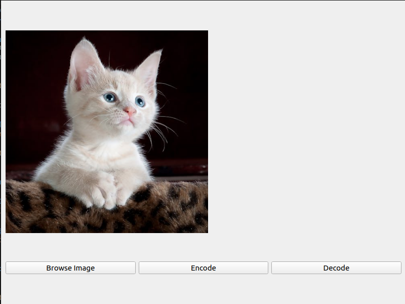

# STEGANOGRAPHY LSB

## Görüntü Steganografisi
Bu proje, görüntü dosyalarının içine gizli mesajlar gizleme uygulaması olan görüntü steganografisinin bir uygulamasını sunar. Kod, bir mesajı görüntünün piksel verilerinin en önemsiz bitlerini değiştirerek görüntüye kodlayabilmenize ve ardından değiştirilmiş görüntüden mesajı çözebilmenize olanak tanır. Bu teknik, "En Önemsiz Bit (Least Significant Bit - LSB)" algoritması olarak bilinir.

### LSB Algoritması


LSB algoritması, bir görüntünün her pikselinin en önemsiz bitlerini değiştirerek gizli bir mesajı kodlamak için kullanılır. Bu algoritma, insan gözünün bu küçük değişiklikleri fark edemeyeceği varsayımına dayanır. Mesaj, her pikselin en önemsiz bitlerini değiştirerek kodlanır ve bu sayede görüntü neredeyse değişmeden kalır.

## Kurulum
Bu proje Python 3 ile geliştirilmiş ve test edilmiştir. Projeyi çalıştırmak için Python 3 ve aşağıdaki kütüphanelerin yüklü olması gerekir:

- OpenCV (cv2)
- NumPy (numpy)
- PyQt5 (GUI için)
Bu kütüphaneleri pip3 ile yükleyebilirsiniz:

```
pip3 install opencv-python numpy pyqt5
```


## Kullanım
Bu projeyi kullanmak için öncelikle GitHub'dan repoyu klonlamanız gerekir. Bunu yapmak için aşağıdaki komutu kullanabilirsiniz:

```
git clone https://github.com/emirhancibir/stega_lsb.git
```

### Komut Satırı Arayüzü (CLI)
Proje, bir komut satırı arayüzü (CLI) sunar. CLI'yı kullanmak için `cli/stega_cli.py` dosyasını çalıştırın:

```
python3 cli/stega_cli.py --help
```
Bu, kullanılabilir komutları ve seçenekleri gösterecektir.

#### Kodlama (Encoding)
Bir mesajı bir görüntüye kodlamak için :
```
python3 cli/stega_cli.py encode /path/to/image.jpg "Gizli mesaj"
```

### Örnek çalıştırma:

#### Orjinal Görüntü


#### Kodlanmış Görüntü


### Çözme (Decoding)
Kodlanmış bir görüntüden mesajı çözmek için:
```
python3 cli/stega_cli.py decode /path/to/encoded_image.png
```


Bu betik, varsayılan olarak imgs/encoded.png dosyasından gizli mesajı çözer ve konsola yazdırır.


#### Grafik Kullanıcı Arayüzü (GUI)
Proje ayrıca bir grafik kullanıcı arayüzü (GUI) sunar. GUI'yi başlatmak için `gui/qt_gui.py` dosyasını çalıştırın:
```
python3 gui/qt_gui.py
```


GUI, görüntü seçme, kodlama ve çözme işlemlerini kolayca gerçekleştirmenizi sağlar.

### Hata Ayıklama
CLI ve GUI uygulamalarında, `--debug` veya `debug=True` seçeneğini kullanarak ara adımları yazdırabilirsiniz. Bu, kodun nasıl çalıştığını anlamanıza yardımcı olabilir.

### Pseudo Kod
#### Kodlama (Encoding)
- Başlat

- Görüntü dosyasını oku
- Görüntü verilerini ve maksimum bayt sayısını al

- Mesajın uzunluğu maksimum bayt sayısından büyükse
    - Hata mesajı yazdır
    - Çık

- Mesajı ikili gösterime dönüştür
- İkili mesajı 2 bitlik parçalara böl

- Görüntü verilerini değiştir:
    - Her piksel için:
        - En önemsiz 2 biti, bölünmüş ikili mesajın karşılık gelen 2 bitlik parçasıyla değiştir

- Değiştirilmiş görüntü verilerini yeni bir dosyaya kaydet
- "INSERTION COMPLETED" mesajını yazdır

- Bitir

#### Çözme (Decoding)
- Başlat

- Kodlanmış görüntü dosyasını oku
- Görüntü verilerini al

- Görüntü verilerini ikili gösterime dönüştür
- Her pikselin en önemsiz 2 bitini al
- Bu bitleri birleştir

- Birleştirilmiş bitleri ASCII karakterlerine dönüştür
- Gizli mesajı yazdır

- Bitir

Bu pseudo kodlar, projenin ana işlevlerini ve veri akışını özetlemektedir. Gerçek kod, OpenCV ve NumPy kütüphanelerini kullanarak görüntü işleme ve veri manipülasyonu işlemlerini gerçekleştirir.
